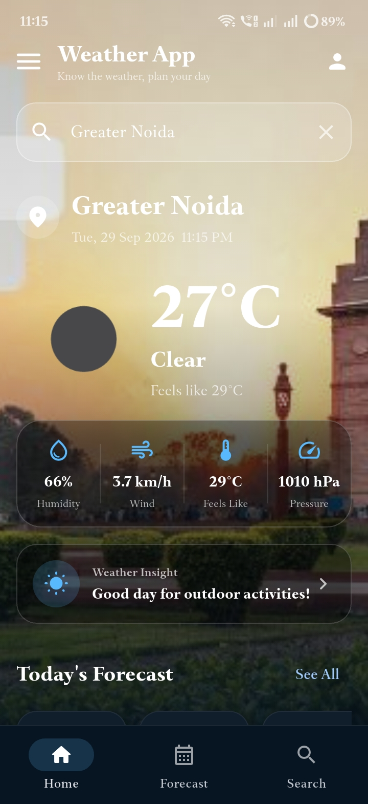
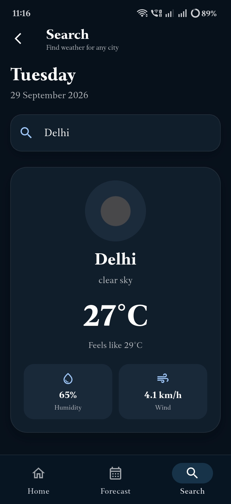
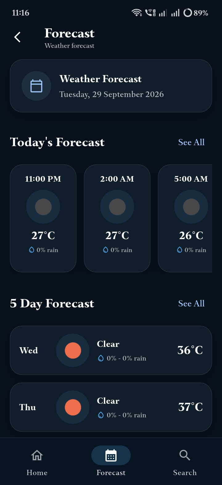
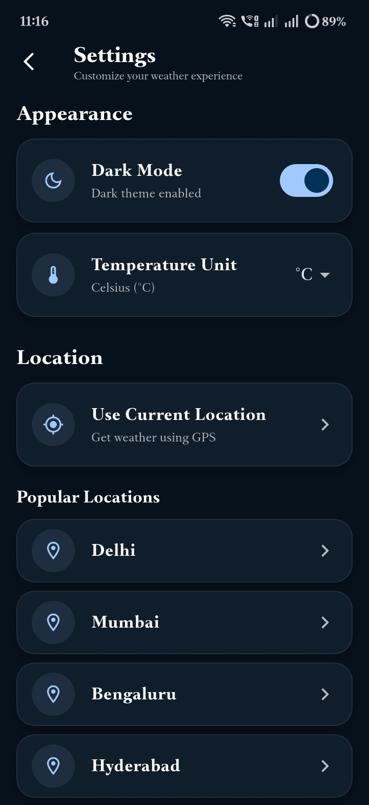

# 🌦️ Weather App

A modern and responsive weather application built with **Flutter** and powered by the **OpenWeather API**.

The Weather App provides real-time weather information based on the user's current location as well as searched cities. It includes current weather conditions, hourly forecasts, a 5-day forecast, location-based weather, search functionality, dark/light mode, profile settings, and a clean modern user interface.

---

## 📱 About The App

**Weather App** is a Flutter-based weather application designed to provide users with quick and easy access to weather information in a clean and user-friendly interface.

The application can automatically detect the user's current location and display the latest available weather information. Users can also search for different cities and view their weather conditions and forecasts.

The app is designed with a modular structure so that different features such as weather services, location services, search, forecasts, screens, and reusable widgets remain separated and easy to maintain.

---

## ✨ Key Features

- 🌍 Current location weather
- 📍 GPS-based weather detection
- 🔎 City weather search
- 🌤️ Current weather conditions
- 🕐 Hourly weather forecast
- 📅 5-day weather forecast
- 💧 Humidity information
- 💨 Wind speed information
- 🌡️ Feels-like temperature
- 📊 Atmospheric pressure
- 🌧️ Rain probability
- 🌙 Dark mode
- ☀️ Light mode
- 👤 User profile screen
- ⚙️ Settings screen
- 🔄 Pull-to-refresh weather data
- 🎨 Modern responsive UI
- ✨ Smooth UI animations
- 🔐 Environment-based API key configuration

---

## 🛠️ Built With

- **Flutter**
- **Dart**
- **OpenWeather API**
- **flutter_dotenv**
- **HTTP**
- **Geolocator**
- **Intl**
- **Material Design**

---

## 🎯 Project Goal

The main goal of this project is to build a practical, real-world Flutter application while following a clean and scalable project structure.

The application separates:

- UI screens
- Reusable widgets
- Models
- API services
- Location services
- Forecast logic
- Application routes
- Theme configuration
- Constants
- Utility functions

This makes the project easier to understand, maintain, test, and extend with new features in the future.

---

## 📸 Screenshots

### 🏠 Home Screen

The home screen displays the current location, current weather conditions, temperature, humidity, wind speed, pressure, weather insights, hourly forecast, and 5-day forecast.

<p align="center">
  
</p>

---

### 🔎 Search Screen

Users can search for a city and get weather information for the selected location.

<p align="center">
  
</p>

---

### 📅 Forecast Screen

The forecast screen provides detailed hourly and daily weather information.

<p align="center">
  
</p>

---

### 👤 Profile Screen

The profile screen allows users to manage their profile information and access application preferences.

<p align="center">
  
</p>

---

### ⚙️ Settings Screen

The settings screen provides options such as dark mode, temperature unit, location settings, and application information.

<p align="center">
  
</p>

---

### 🌙 Dark Mode

The application also supports a dark theme for a comfortable viewing experience in low-light environments.

<p align="center">
  
</p>

---
---

## 🏗️ Project Structure

The project follows a modular Flutter structure where screens, reusable widgets, services, models, application configuration, constants, and utilities are kept separately.

```text
weather_app/
│
├── assets/
│   ├── images/
│   │   └── screenshots/
│   │       ├── home_screen.png
│   │       ├── search_screen.png
│   │       ├── forecast_screen.png
│   │       ├── profile_screen.png
│   │       ├── settings_screen.png
│   │       └── dark_mode.png
│   │
│   ├── icons/
│   └── animations/
│
├── lib/
│   │
│   ├── main.dart
│   │
│   ├── app/
│   │   ├── app.dart
│   │   ├── routes.dart
│   │   └── theme.dart
│   │
│   ├── core/
│   │   ├── constants/
│   │   │   ├── app_colors.dart
│   │   │   ├── app_strings.dart
│   │   │   └── api_constants.dart
│   │   │
│   │   ├── error/
│   │   │   └── app_exception.dart
│   │   │
│   │   └── utils/
│   │       └── helpers.dart
│   │
│   ├── models/
│   │   ├── weather_model.dart
│   │   ├── location_search_model.dart
│   │   ├── forecast_model.dart
│   │   └── daily_forecast_model.dart
│   │
│   ├── services/
│   │   ├── weather_service.dart
│   │   ├── location_service.dart
│   │   ├── location_search_service.dart
│   │   └── forecast_service.dart
│   │
│   ├── screens/
│   │   ├── home/
│   │   │   ├── home_screen.dart
│   │   │   ├── welcome_screen.dart
│   │   │   └── profile_screen.dart
│   │   │
│   │   ├── search/
│   │   │   └── search_screen.dart
│   │   │
│   │   ├── forecast/
│   │   │   └── forecast_screen.dart
│   │   │
│   │   └── settings/
│   │       └── settings_screen.dart
│   │
│   └── widgets/
│       ├── common/
│       │   ├── app_loading.dart
│       │   ├── app_error.dart
│       │   └── custom_button.dart
│       │
│       ├── weather/
│       │   ├── weather_header.dart
│       │   ├── weather_info_card.dart
│       │   ├── hourly_forecast.dart
│       │   └── daily_forecast.dart
│       │
│       └── search/
│           ├── weather_search_bar.dart
│           └── location_search_results.dart
│
├── test/
│
├── .env
├── .gitignore
├── pubspec.yaml
└── README.md

---


## 🛠️ Technology Stack

| Technology | Purpose |
|---|---|
| Flutter | Cross-platform mobile application framework |
| Dart | Programming language used for the application |
| OpenWeather API | Provides real-time weather and forecast data |
| Material Design | UI components and application design |
| Android | Mobile application platform |

---

## 📦 Flutter Packages

The application uses the following packages:

| Package | Purpose |
|---|---|
| `http` | Makes HTTP requests to weather APIs |
| `flutter_dotenv` | Loads environment variables such as the API key |
| `geolocator` | Detects the user's current GPS location |
| `intl` | Formats dates and times |
| `cupertino_icons` | Provides Cupertino-style icons |

---

## 🔌 API Integration

This application uses the **OpenWeather API** to retrieve weather information.

The API is used for:

- 🌡️ Current temperature
- 🌤️ Weather condition
- 💧 Humidity
- 💨 Wind speed
- 📊 Atmospheric pressure
- 🌡️ Feels-like temperature
- 🌧️ Rain probability
- 🕐 Hourly forecast
- 📅 Multi-day forecast

### API Flow

```text
Flutter Application
        │
        ▼
WeatherService
        │
        ▼
OpenWeather API
        │
        ▼
JSON Response
        │
        ▼
Dart Models
        │
        ▼
Flutter UI

---


## 🚀 Installation & Setup

Follow the steps below to run the Weather App locally.

### 1️⃣ Clone the Repository

```bash
git clone https://github.com/nitinsharma9266/weather_app.git

---

---

## 🚀 Application Features

### 🌍 Location-Based Weather

The application can detect the user's current location using GPS and retrieve weather information for that location.

### 🔎 City Search

Users can search for a city and view weather information for the selected location.

### 🌤️ Current Weather

The Home screen displays important current weather information including:

- Current temperature
- Weather condition
- Feels-like temperature
- Humidity
- Wind speed
- Atmospheric pressure

### 🕐 Hourly Forecast

The application provides upcoming hourly weather information including:

- Forecast time
- Weather icon
- Temperature
- Rain probability

### 📅 5-Day Forecast

Users can view upcoming daily weather information including:

- Day
- Weather condition
- Weather icon
- Temperature
- Rain probability

### 🔄 Pull to Refresh

Users can pull down on the Home screen to request updated weather information.

### 🌙 Dark Mode

The application supports both light and dark themes for a better viewing experience in different environments.

### 👤 Profile

The Profile screen provides options for:

- Editing profile information
- Selecting temperature units
- Switching dark mode
- Opening settings
- Viewing application information

### ⚙️ Settings

The application includes a dedicated settings screen for managing application preferences and weather-related options.

### 🎨 Modern UI

The application uses reusable Flutter widgets, rounded cards, subtle shadows, animations, and responsive layouts to create a modern weather dashboard.

---

## 🔮 Future Improvements

The project can be extended with additional features in future versions.

Planned improvements may include:

- [ ] Persistent user profile data
- [ ] Persistent temperature unit preference
- [ ] Saved/favorite cities
- [ ] Weather notifications
- [ ] Weather alerts
- [ ] More detailed weather information
- [ ] Weather history
- [ ] Improved offline support
- [ ] Better API error handling
- [ ] Additional weather animations
- [ ] Automatic weather refresh
- [ ] Home screen widgets
- [ ] Google Play Store release
- [ ] Automated testing
- [ ] Backend integration for advanced features

---

## 📊 Project Status

**Current Status:** 🚧 Active Development / UI Refinement

The core weather functionality is implemented, including location-based weather, city search, hourly forecast, daily forecast, navigation, profile, settings, and theme support.

The project is currently being refined with additional UI improvements, testing, optimization, and future feature development.

---

---

## 📦 Download APK

You can download and install the latest release APK of the Weather App from the link below.

### 📱 Android APK

**[Download Weather App APK](https://drive.google.com/file/d/1BlVJnkPDCq6Z-qZP5_lZInKa2UhVZY5l/view?usp=sharing)**

> ⚠️ This APK is distributed directly for testing and demonstration purposes. Android may show a security warning when installing an APK downloaded from outside the Google Play Store.

### Installation

1. Download the APK.
2. Open the downloaded APK file.
3. Allow installation from the required source if Android asks for permission.
4. Install the application.
5. Open **Weather App** and allow location permission when requested.

---

## 🎥 App Demo

The application demonstrates:

- 📍 GPS-based weather detection
- 🔎 City search
- 🌤️ Current weather
- 🕐 Hourly forecast
- 📅 5-day forecast
- 🌙 Dark mode
- 👤 Profile
- ⚙️ Settings
- 🔄 Weather refresh
- 🎨 Modern responsive UI

---

## 💻 Development Environment

The project was developed using:

```text
Flutter
Dart
VS Code
Android
OpenWeather API
Git
GitHub

---

## 👨‍💻 Developer

### Nitin Sharma

B.Tech Computer Science Engineering student and aspiring Flutter Developer interested in building modern mobile applications using Flutter and Dart.

I built this Weather App as a practical project to improve my understanding of:

- Flutter application development
- Dart programming
- REST API integration
- JSON data handling
- GPS and location services
- Reusable widget development
- Application navigation
- State handling
- Responsive UI design
- Dark/Light theme implementation
- Git and GitHub

### 🔗 Connect With Me

- **GitHub:** [nitinsharma9266](https://github.com/nitinsharma9266)
- **Project Repository:** [Weather App](https://github.com/nitinsharma9266/weather_app)

---

## ⭐ Support

If you find this project useful or interesting, consider giving the repository a ⭐ on GitHub.

Your feedback and suggestions are always welcome.

---

## 📄 License

This project is currently intended for learning, portfolio, and demonstration purposes.

---